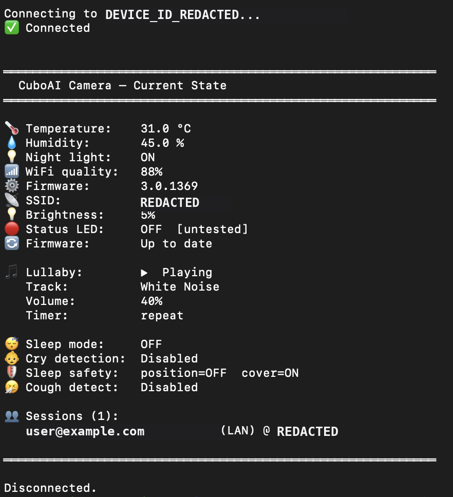

# CuboAI Camera — Python Integration

A Python library for controlling CuboAI baby monitor cameras locally,
without relying on the CuboAI cloud. Enables local control of all camera
features and live video/audio streaming.



## Features

| Feature | Status |
|---------|--------|
| Temperature & humidity | ✅ Working |
| Night light on/off | ✅ Working |
| Night light brightness | ✅ Working |
| Status LED | ✅ Working (untested on all models) |
| Lullaby play/stop/select (34 songs) | ✅ Working |
| Lullaby volume control | ✅ Working |
| Lullaby sleep timer | ✅ Working |
| Sleep mode (privacy mode) | ✅ Working |
| Cry detection status | ✅ Working (read only) |
| Sleep safety detection status | ✅ Working (read only) |
| Cough detection status | ✅ Working (read only) |
| Firmware version check | ✅ Working |
| Session history | ✅ Working |
| JPEG snapshot | ✅ Working |
| HEVC video stream | ✅ Working |
| AAC audio stream (16kHz mono) | ✅ Working |
| Talk to baby (send audio) | ⚠️ Implemented, untested |
| go2rtc video stream | ⚠️ Implemented, untested |
| go2rtc audio stream | ⚠️ Implemented, untested |
| Cry/cough detection enable/disable | 🔬 Payload format unconfirmed |
| Detection zones | 🔬 Complex struct, not implemented |

## Files

```
cuboai_messages.py       — IOCTL protocol definitions, builders, parsers
cuboai_tutk.py           — TUTK library wrapper (ctypes), TUTKSession class
cuboai_validate.py       — Full CLI tool for testing and control
cuboai_stream_video.py   — go2rtc exec source: HEVC video to stdout [untested]
cuboai_stream_audio.py   — go2rtc exec source: AAC audio to stdout [untested]
LIBRARY_SETUP.md         — How to obtain the required native library
PROTOCOL_RESEARCH.md     — Deep-dive into how the protocol works
```

## Download

Download the files from the [GitHub releases page](https://github.com/niruse/cuboai/issues/3)
or clone the repository:
```bash
git clone https://github.com/niruse/cuboai.git
cd cuboai
pip install av   # only needed for snapshots and --talk
```

## Requirements

- Python 3.9+
- The TUTK native library (see [LIBRARY_SETUP.md](LIBRARY_SETUP.md))
- PyAV (`pip install av`) — for snapshots and `--talk` (send audio to camera)

## Architecture support

| Architecture | Hardware | Status |
|---|---|---|
| x86-64 | Intel/AMD Linux, most HA VMs, NUCs | ✅ Tested and working |
| aarch64 | Raspberry Pi 4/5, Apple Silicon | ⚠️ Untested |

> **Raspberry Pi users:** The code has aarch64 library loading support built in,
> but the `_AVClientStartInConfig` struct layout has **not been verified** on ARM64.
> If `avClientStartEx()` returns `-20000`, the struct field offsets are likely
> wrong for your library version. Use Frida to confirm the actual offsets and
> please report your findings in the issue tracker.

## Quick start

### 1. Get your camera credentials

The camera credentials are stored in the CuboAI cloud. You need to intercept
the app's API traffic once to retrieve them — after that, everything works
locally on your LAN.

Intercept the CuboAI app's HTTPS traffic using a tool like mitmproxy or
Charles Proxy. The app calls:
```
GET https://app-api.getcubo.com/prod/user/cameras
```
and receives a JSON array containing your camera's `license_id`,
`dev_admin_id`, and `dev_admin_pwd`. See
[PROTOCOL_RESEARCH.md](PROTOCOL_RESEARCH.md) for details.

### 2. Get the native library

See [LIBRARY_SETUP.md](LIBRARY_SETUP.md). Place it at:
```
libs/x86_64/libIOTCAPIs_ALL.so        # Intel/AMD Linux (single combined lib)
libs/aarch64/libTUTKGlobalAPIs.so     # Raspberry Pi (three separate libs)
libs/aarch64/libIOTCAPIs.so
libs/aarch64/libAVAPIs.so
```

### 3. Check camera status

```bash
python3 cuboai_validate.py \
  --lib libs/x86_64/libIOTCAPIs_ALL.so \
  --uid YOUR_UID \
  --account YOUR_ACCOUNT \
  --password YOUR_PASSWORD \
  --camera-ip 192.168.1.x
```

### 4. Take a snapshot

```bash
python3 cuboai_validate.py [connection args] --no-status --snapshot camera.jpg
```

### 5. Record video + audio

```bash
python3 cuboai_validate.py [connection args] --no-status \
  --record-av /tmp/clip --duration 10
# Produces: /tmp/clip.hevc + /tmp/clip.aac
```

## Control commands

```bash
# Night light
--night-light on|off
--brightness 0-100

# Lullaby
--play "white noise"      # partial name match, case-insensitive
--play "brahms"
--stop
--volume 0-100
--timer repeat|30min|60min
--list-songs              # show all 34 available songs

# Sleep mode (suspends video feed)
--sleep-mode on|off
```

## Using in Python

```python
from cuboai_tutk import TUTKSession
from cuboai_messages import (
    build_get_hw_control, HWControl, IOTYPE_USER_GET_HW_CONTROL_RESP,
    build_set_night_light,
)

with TUTKSession(uid, account, password,
                 lib_path='libs/x86_64/libIOTCAPIs_ALL.so',
                 camera_ip='192.168.1.x') as sess:
    # Read temperature
    tc, data = sess.ioctl(*build_get_hw_control())
    hw = HWControl.parse(data)
    print(f"{hw.temperature:.1f}°C  {hw.humidity:.1f}%")

    # Turn on night light
    sess.ioctl(*build_set_night_light(True))

    # Take a snapshot
    jpeg = sess.snapshot()
    with open('snap.jpg', 'wb') as f:
        f.write(jpeg)

    # Stream video+audio
    for frame_type, data in sess.av_frames(duration=30):
        if frame_type == 'video':
            video_file.write(data)
        else:
            audio_file.write(data)
```

## go2rtc integration (untested)

```yaml
# go2rtc.yaml
streams:
  cuboai:
    - exec:python3 /path/to/cuboai_stream_video.py#{killsignal=SIGTERM}
    - exec:python3 /path/to/cuboai_stream_audio.py#{killsignal=SIGTERM}

# Environment variables (set in your shell or go2rtc config)
# CUBOAI_UID, CUBOAI_ACCOUNT, CUBOAI_PASSWORD, CUBOAI_CAMERA_IP, CUBOAI_LIB
```

## Background: why this approach?

CuboAI uses the ThroughTek Kalay P2P SDK (TUTK) — the same SDK used by many
other camera brands (Wyze, Reolink, etc.). There's no official API.

We reverse-engineered the protocol by:
1. Decompiling the Android app with JADX
2. Hooking the native library with Frida on an Android emulator
3. Analysing UDP packet captures

Once you have the device credentials, all camera control works locally on
your LAN with no cloud involvement. The credentials themselves are stored
in the CuboAI cloud (retrieved via the REST API) — you need internet access
once to fetch them, but after that the integration works fully offline.
The credentials are provisioned during initial camera pairing and do not
change unless the camera is reset or re-paired.

See [PROTOCOL_RESEARCH.md](PROTOCOL_RESEARCH.md) for the full story.

## Related projects

- [wyzecam](https://github.com/kroo/wyzecam) — same TUTK SDK, different camera
- [wyze-bridge](https://github.com/mrlt8/docker-wyze-bridge) — go2rtc + TUTK; source of the x86-64 `libIOTCAPIs_ALL.so` used in this integration
- [getcubo GitHub issue](https://github.com/niruse/cuboai/issues/3) — original discussion

## Disclaimer

This is an unofficial integration. It is not affiliated with or endorsed by
CuboAI Inc. or ThroughTek Co. Ltd. Use at your own risk. The integration
communicates directly with your camera on your local network.
